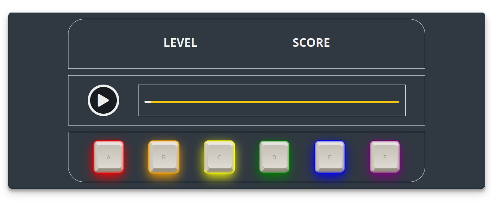

# KeyBeats (Working title)
## *Play your keyboard to match the beats*



## How to play
* ### Simple clean fun with your keyboard.
* Click play.
* Listen to the musical sequence.
* Use the keyboard keys and press the keys in musical sequence.
* Level up by getting all of the musical sequence correct.

### Deployed link

[Click here to play!](https://www.example.com)

### How to install
No installation required, just click and play :)

## Setup

### Description of the design (Screenshots, wireframe)

*The landing page*


*The how to play page*


*The game page*


### Color Palette
[Sourced from She Codes](https://palettes.shecodes.io/palettes/1100#palette)

A simple colour palette to reflect the them of a retro keyboard game, inspired by the [Launchpad X](https://novationmusic.com/en/launch/launchpad-x). Keeping to metallic colours that allow the keyboard to pop. 


```
--outer-space: hsl(212, 15%, 22%);
--limed-spruce: hsl(205, 16%, 27%);
--ripe-lemon: hsl(48, 93%, 51%);
--gallery: hsl(0, 0%, 93%);
```

### Fonts 
[Sourced from Google Fonts](https://fonts.google.com/)

Main font: 'Special Elite' - for the body and headings.
Paired with: 'Yesteryear' - chosen to add a small style change for the footer.

### Logical flow


### Future development
* Add a leaderboard 
    * Save score and present in table
* Play with 3 lives 
    * Three chances to get the sequence correct, otherwise lose lives
* Define accurate point system
    * Length of keypress to determine whether user sticking to the tempo and rhythm

## Credits

* [Nathalie Ivette De McDermott](https://www.linkedin.com/in/ivette-mc-dermott-8b2045242/)
* [Massimo Ranali](https://www.linkedin.com/in/massimo-ranalli-11253315b/)
* [Trevor Lehmann](https://www.linkedin.com)
* [Patrick Alexander Lucas Van Der Flier](https://www.linkedin.com)
* [Sirinya Richardson](https://www.linkedin.com/in/sirinya-richardson/)

