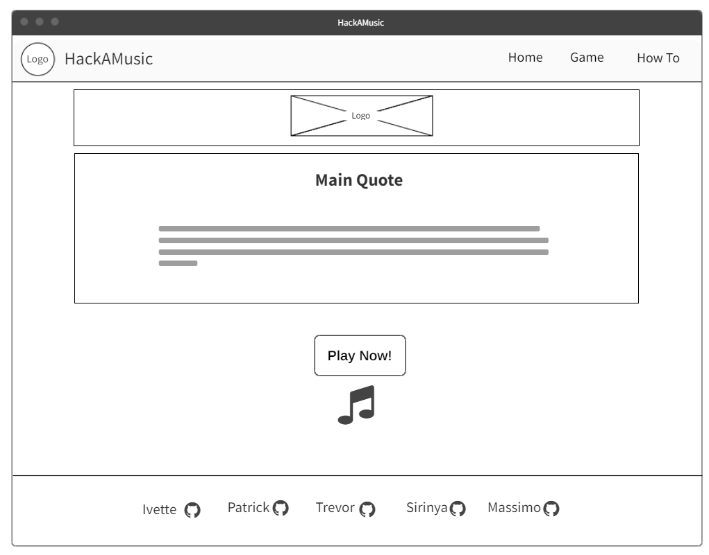
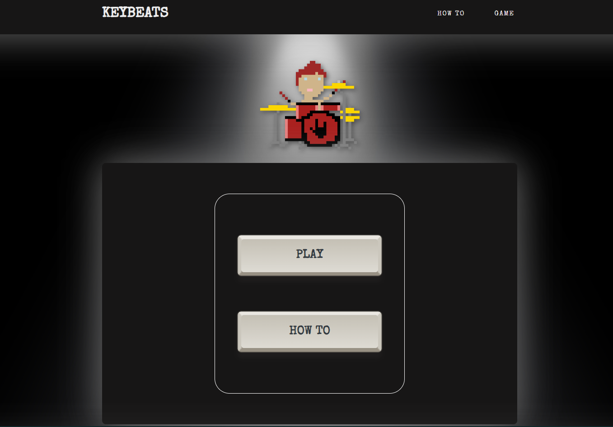
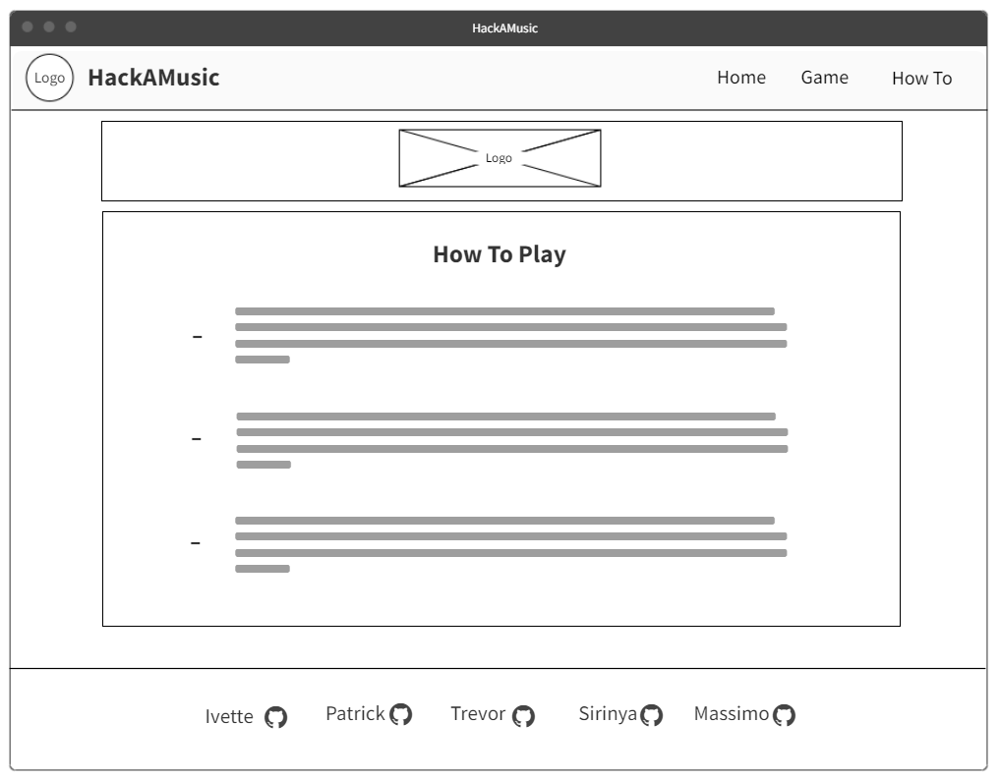
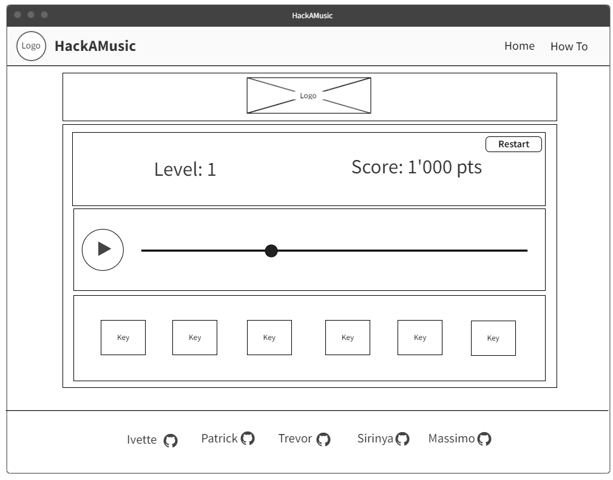
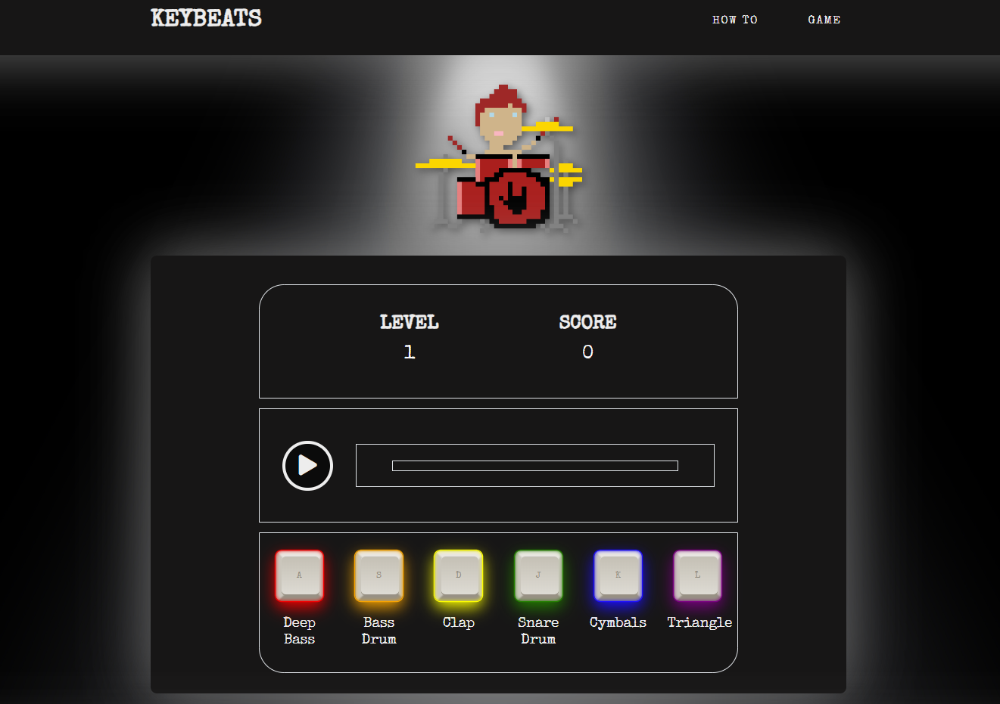

# KeyPlayers presents: KEYBEATS

## *"Play your keys, match the beats!"*
 

KeyBeats is a music memory game easy to navigate and play. The user listens to a sound sequence and then is challenged to recreate it pressing the keys in his keyboard, each one reproducing six different sounds. Success in making the sequence will bring the game to the next level: each level up will increment the sequence with one more sound!
 
The project has been developed to compete in the *Code Instutute Hackaton Hero Challenge*.

 

## Deployed link

[KeyBeats - Click here to play!](https://vanderpatrick.github.io/HackAMusic/index.html)

 

## How to install
No installation required, just click and play!

 

## User Stories

- As a user, I want to have an intuitive navigation in the game.
- As a user, I want to listen a sequence of sounds.
- As a user, I want to reproduce the sequence and with a response from the game that reinforces what sound I am generating.
- As a user, I want to know if I succeded or not in the sequence.
- As a user, I want to know my score and what level I am in.
- As a user, I want to read the game instructions and have a playground to practice my skills.

## Wireframes and Web Pages

### 1 - The home page
The home page is clean and simple: its sole scope is to invite the user to read the instructions and/or play the game.

 

 

 

### 2 - The how to play page
This page explains the rules of the game and gives to the user the possibility to test the different sounds.

### How to play:
1. This game is oriented to users who can play with their keyboard.
2. The user press enter to play the sequence of sounds.
3. The user listen to the musical sequence.
4. The user press the keys in its keyboard to play six different sounds and match the sequence.
5. The user progresses in the game by playing all the sounds of the musical sequence correctly.

 

 

 

### 3 - The game page
The game page contains a game area with three main sections:
- The upper part shows the level the user is playing in and the score he has gained.
- The middle part contains the player, where the user can start the sound sequence. A progress bar keeps track of its duration.
- The lower part shows the different key buttons associated with six different sounds.

 

 

 

## Design

 

### Colour Palette
The colour palette is studied to highlight the keyboard buttons, whose colors are inspired by the [Launchpad X](https://novationmusic.com/it/launch/launchpad-x). These colors are metallic and allow the keyboard to pop from the background. 

 

 

### Fonts

- Main font: 'Special Elite' - for the body and headings.
- Paired with: 'Yesteryear' - chosen to add a small style change for the footer.

 

## Features

The site consists of three pages, whose objective is to present the game to the user and make the playing session smooth, intuitive and enjoyable.
The game is meant to be played with a keyboard and has several visual effect (shake and color of the keys, progress bar) for a better  user experience and engagement.

 

### Possible features to implement in future

 

* Add a leaderboard: 
    - Save score of every user and present it in a table.
* Play with 3 lives: 
    - Three chances to get the sequence correct, before the user loses the games and comes back to level 1.
* Introduce timing of key press for a much more engaging experience:
    - Length of keypress to determine whether user is sticking to the tempo and rhythm.

## Bugs

 
At the moment no bug has been noticed.

 

## Technologies used

 

* [HTML](https://en.wikipedia.org/wiki/HTML5)
* [CSS](https://en.wikipedia.org/wiki/CSS)
* [JavaScript](https://en.wikipedia.org/wiki/JavaScript)

* [GitHub](https://github.com/)
* [GitPod](https://www.gitpod.io/)

* [BootStrap](https://getbootstrap.com/)
* [SweetAlert2](https://sweetalert2.github.io/)
* [Google Fonts](https://fonts.google.com/)
 

## Validation

 
All the code has been tested in validators sites as follows:

* HTML and CSS via [w3c](https://validator.w3.org/): no errors.
* JavaScript via [JsHint](https://jshint.com/): no errors.

Manual testing had been implemented: the game is running as expected.

 

## Credits

* Palette   [She Codes](https://palettes.shecodes.io/palettes/1100#palette)
* Media audios   [Freesound](https://freesound.org/)

* [Launchpad X](https://novationmusic.com/en/launch/launchpad-x)  

* Research  
    [Stack Overflow](https://stackoverflow.com/)  
    [GeeksforGeeks](https://www.geeksforgeeks.org/)

